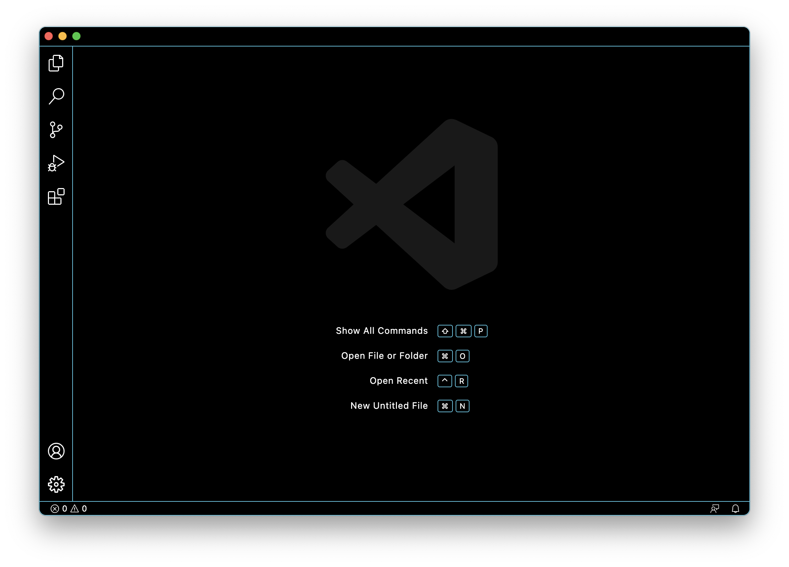
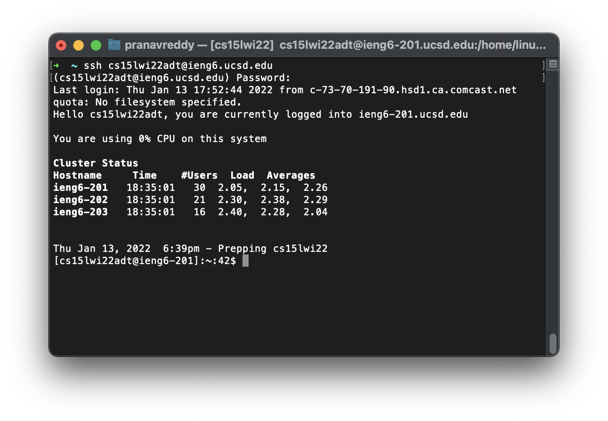
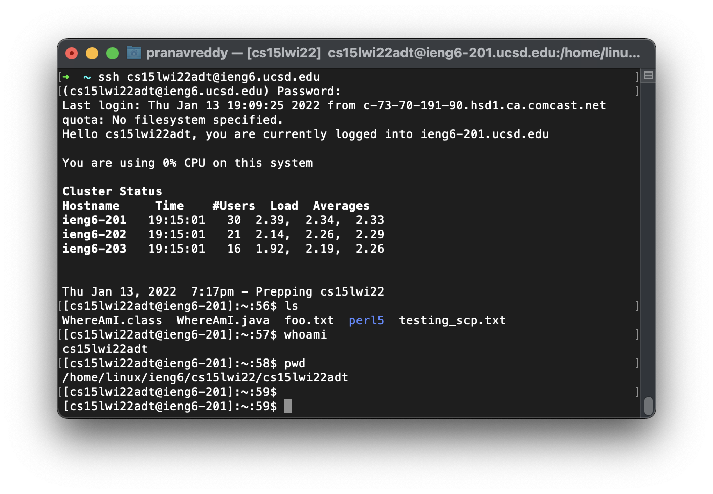
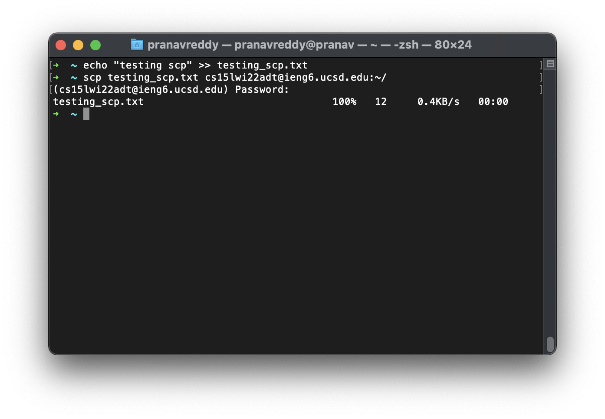
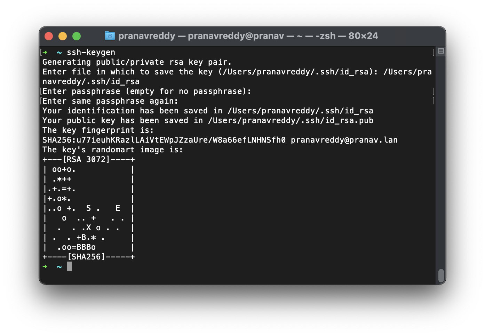
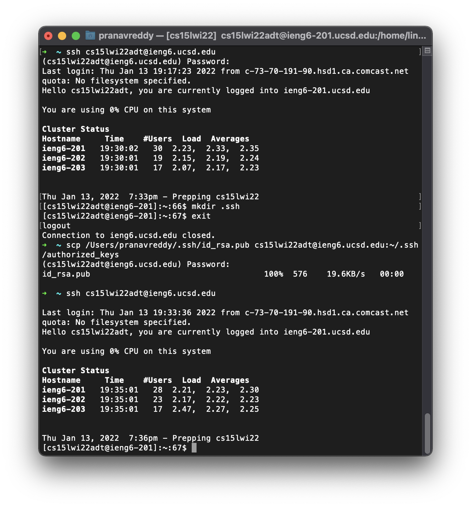

# How to Set Up Your Course Account

## 1. Installing VScode
We need a place on our computer to edit our code. There are a lot of popular choices, but we will use Visual Studio Code (VSCode) from Microsoft. 

Download and install VSCode [here](https://code.visualstudio.com/). Follow their instructions for installing it on your machine.

When you finish you should be able to open VSCode and see a screen like this (mine may look different due to different themes, fonts, etc): 



## 2. Remotely Connecting
A lot of CSE courses involve using the UCSD lab computers. However, sometimes we are not able to physically access these computers. To get around this, let's remotely connect to the UCSD servers.

First, open a terminal in VSCode (Control + Shift + `, or use the menu). Then, type in this command:

```
ssh cs15lwi22<xyz>@ieng6.ucsd.edu
``` 
You will have to replace the "\<xyz\>" with your id.

You might get a message along the lines of "the authenticity of so-and-so cannot be established. Do you want to connect?" Say yes (we already know who we are connecting to). Enter you account password (you can set that [here](https://sdacs.ucsd.edu/~icc/index.php)).

The final product should look something like this:



## 3. Trying Some Commands
Now that you're logged in, try running some commands like `cd`, `mkdir`, `echo`, or `ls`.

Some cool commands:
* `cd ~`
* `whoami`
* `pwd`
* `ls -l`
* `ls -lat`



## 4. Moving Files With `scp`
An important tool in working with remote connections is the ability to move files between these two computers. We can use a variety of different tools for this, but we will use a command-line tool to accomplish this here

This commands is called `scp`, and it is from on the client (your computer, not logged into the server), to send files to the server (ieng6.ucsd.edu). 

Logout of the server (Control+D or type the command `exit`) and type the following into your computer:
```
echo "trying out scp" >> testing_scp.txt
```
```
scp testing_scp.txt cs15lwi<xyz>@ieng6.ucsd.edu:~/
```

You'll be asked for your password again, similar to when you logged in using `ssh`. 

The `:~/` part at the end is new. The `:` tells the program that you are specifying a remote location (not on your computer) and the `~/` specifies where to put the file. In this case it will be located in you home directory.

It should look something like this:


Now if you log in again using `ssh`, you'll be able to see that there is a file called `testing_scp.txt` on the server.

## 5. Setting an `ssh` Key
Entering our password each time we use `ssh` or `scp` is very tedious. Luckily, we can avoid having to do this everytime if we use `ssh` keys. The idea is that we'll use a program called `ssh-keygen` to create two "keys": a **public key** and a **private key**. The public key will go on the server (and any other servers you want to log into) and we'll keep the private key on our machine. Now whenever we login, we can use this public-private key pair to login instead of a password.

***Note: This means whoever has your private key can login to any machine with the corresponding public key. Be careful.***

On the client (your computer):
```
$ ssh-keygen
Generating public/private rsa key pair.
Enter file in which to save the key (/Users/<your username>/.ssh/id_rsa): /Users/<your username/.ssh/id_rsa
Enter passphrase (empty for no passphrase): 
Enter same passphrase again: 
Your identification has been saved in /Users/<your username>/.ssh/id_rsa
Your public key has been saved in /Users/<your username>/.ssh/id_rsa.pub

# ... (more output that is irrelevant to us)
```


I didn't use a passphrase so that I can login without having to enter one, but if you do choose one bear in mind you'll have to enter it each time you login. Here's what mine looks like:


Now in the `.ssh` directory of our user account we have two files: 
* the private key: `id_rsa`
* the public key: `id_rsa.pub`.

Now we need to get `id_rsa.pub` onto the server. We will use scp to do this.

```
# On client
$ ssh cs15lwi<xyz>@ieng6.ucsd.edu:~/
<password>

# Now on server
$ mkdir .ssh
$ exit

# Back on client
$ scp /Users/<your username>/.ssh/id_rsa.pub cs15lwi22<xyz>@ieng6.ucsd.edu:~/.ssh/authorized_keys
```
This will copy `id_rsa.pub` (the public key) to the `.ssh` directory on the server that we made. 



Now when you try logging in, you shouldn't need a password. Try it yourself. 

## 6. Optimizing Remote Running