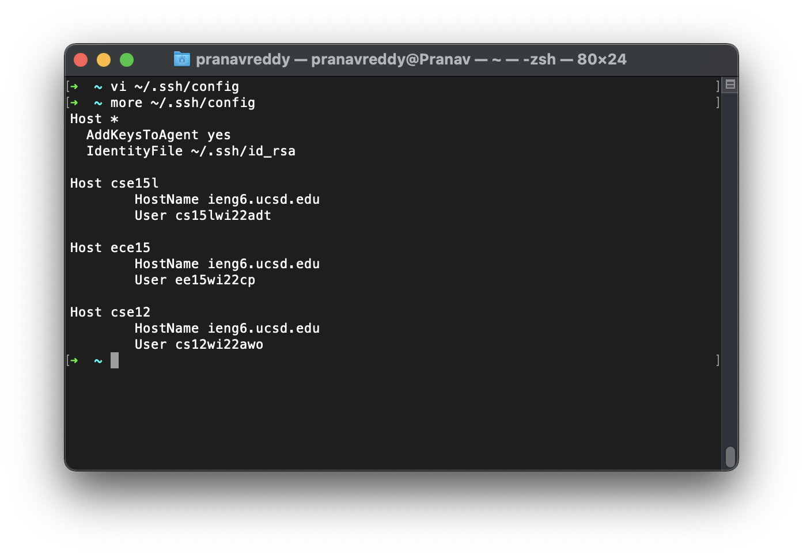
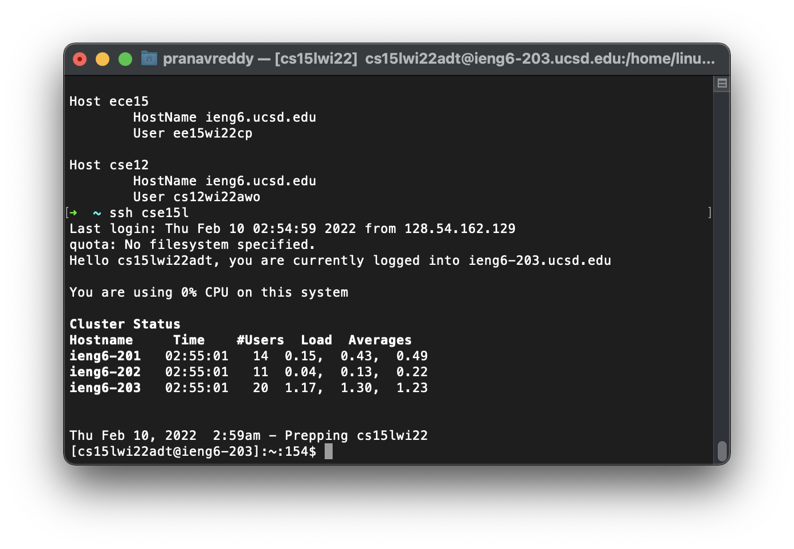
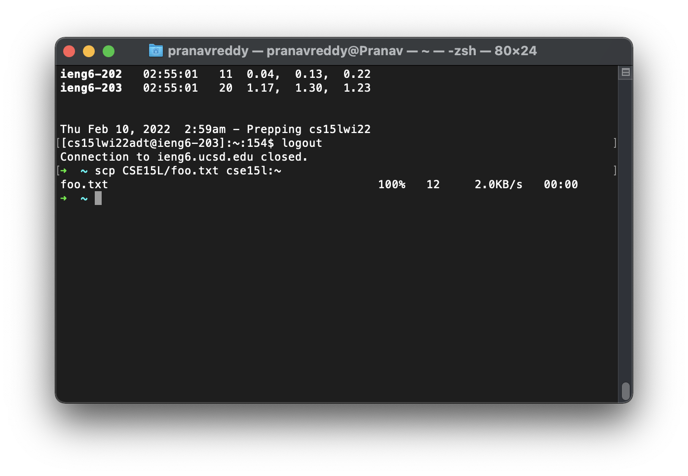

[Back to the main page](index.md)

# Streamlining `ssh` Configuration
Typing out my username every time I need to log in is tedious, and I'm a busy man who can't be bothered to do all this typing. Let's speed up this `ssh` thing.

## Editing `.ssh/config`

Above, you can seed the contents of the file after I edited it using vim. I normally don't use vim, but for such small edits I couldn't be bothered to open VSCode (busy man!). The key part is to add that first `Host` section with your ssh keys (if you have them). After that, each account you wish to connect to using `ssh` should be its own separate host with an alias you choose, as you can see above.

## Logging On With The New Config

As you can see above, I no longer need to type out the full username and address of the account and server I wish to connect to. Instead, I can just specify the alias I previously defined in the `.ssh/config` file. This will undoubtedly save me dozens of precious seconds.

## Using `scp` With the New Alias

I copied a small text file called `foo.txt` to my CSE15L course account using the `cse15l` alias I defined. This is really useful for making edits on my computer and then using them somewhere else on the lab computers.