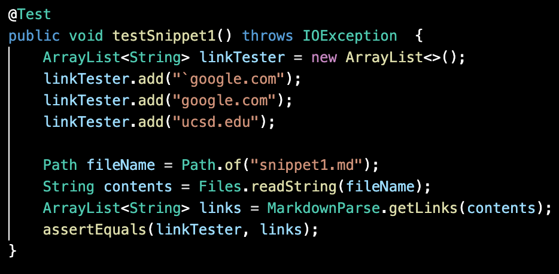
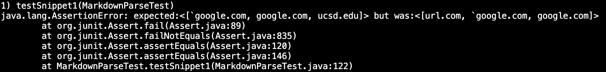
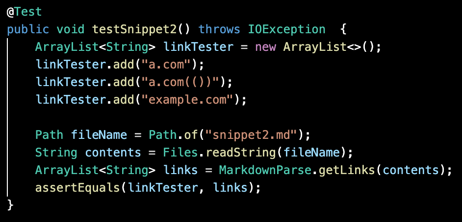
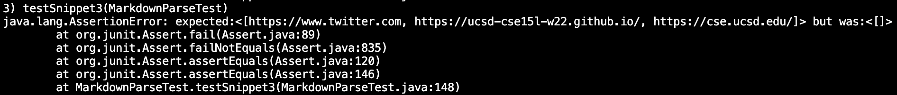

[Back to the main page](../index.md)

# Debugging Markdown Parse

Our github repository: 
[https://github.com/pranavnreddy/markdown-parse.git](https://github.com/pranavnreddy/markdown-parse.git)

The other group's github repository: [https://github.com/merrickqiu/markdown-parse](https://github.com/merrickqiu/markdown-parse)


## [Snippet 1](snippet1.md)
The correct output for this snippet would be:
``` 
[`google.com, google.com, ucsd.edu]
```

The test:


### Our Group's Output


### Other Group's Output


I don't think there is a "small" (<10 lines) change that I could make to fix this issue. I believe it would require significant fixes to parse through backticks and ensure that links encased in triple backticks get properly parsed, similar to the nested parenthesis fix.


## [Snippet 2](snippet2.md)
The correct output for this snippet would be:
``` 
[a.com, a.com(()), example.com]
```

The test:


### Our Group's Output


### Other Group's Output


I think this could be a short, but involved change. The issue is that our code checks if there are opening parentheses before the next closing parenthesis, but if we just check that the nested parentheses are valid, which shouldn't be too long. I think it would just require 1 while loop or helper method to check.

## [Snippet 3](snippet3.md)
The correct output for this snippet would be:
``` 
[https://www.twitter.com, https://ucsd-cse15l-w22.github.io/, https://cse.ucsd.edu/]
```

The test:


### Our Group's Output


### Other Group's Output


This seems to be a much simpler fix. I think the easiest code change is to use the `String.trim()` method before adding the URL to the list.