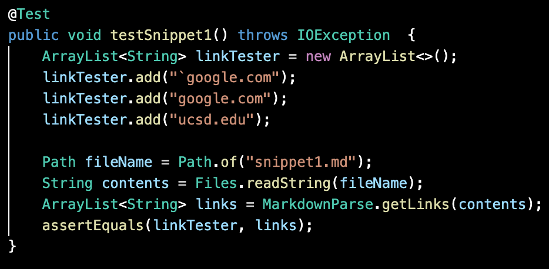
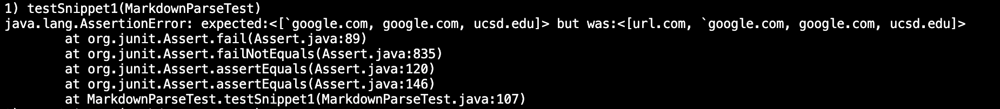
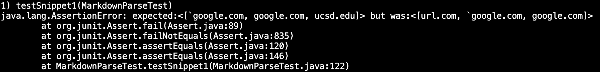
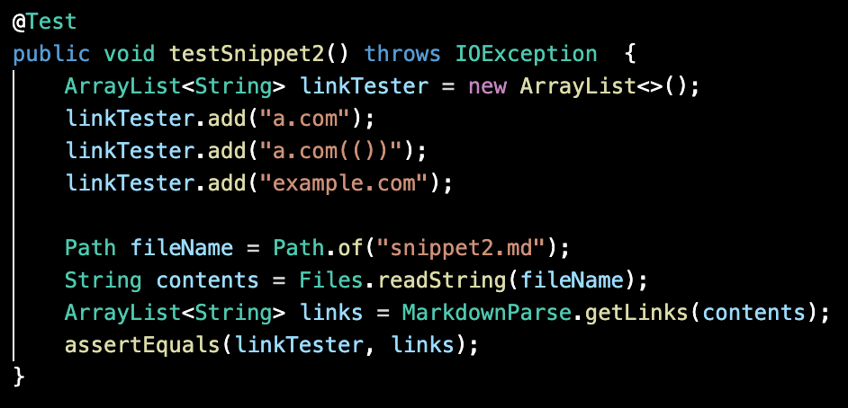
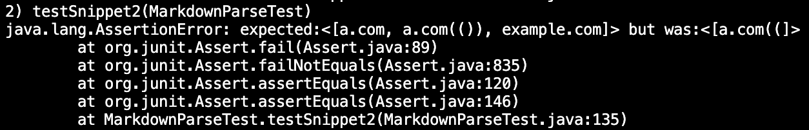
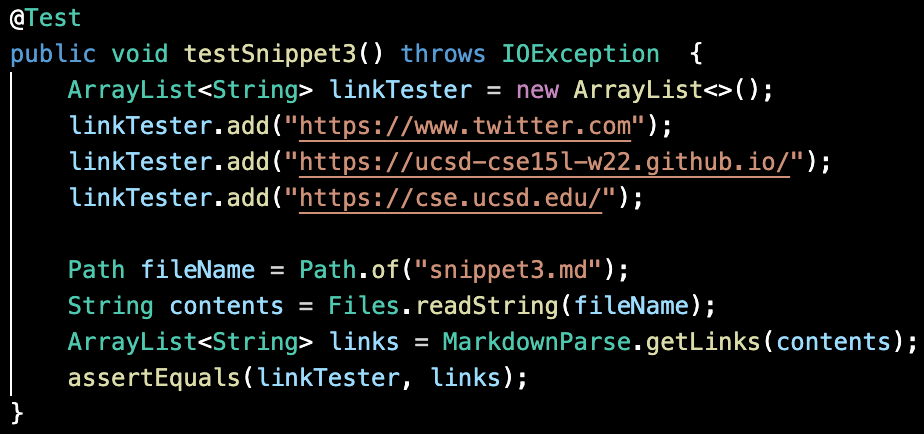
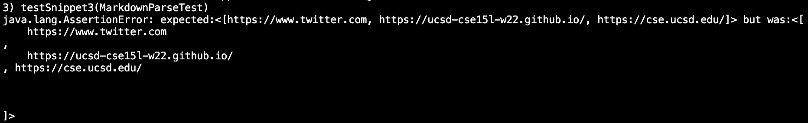
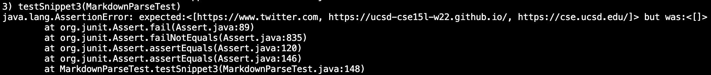

# Debugging Markdown Parse

## [Snippet 1](snippet1.md)
The correct output for this snippet would be:
``` 
[`google.com, google.com, ucsd.edu]
```

The test:


### Our Group's Output


### Other Group's Output


## [Snippet 2](snippet2.md)
The correct output for this snippet would be:
``` 
[a.com, a.com(()), example.com]
```

The test:


### Our Group's Output


### Other Group's Output


## [Snippet 3](snippet3.md)
The correct output for this snippet would be:
``` 
[https://www.twitter.com, https://ucsd-cse15l-w22.github.io/, https://cse.ucsd.edu/]
```

The test:


### Our Group's Output


### Other Group's Output


