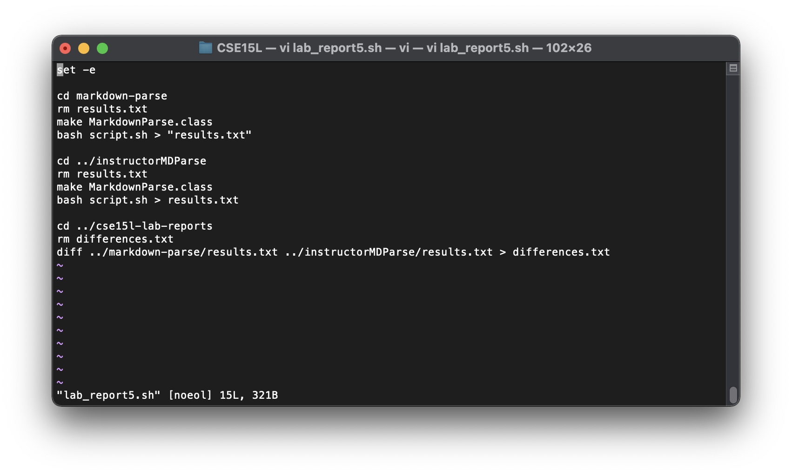

[Back to the main page](../index.md)

# Comparing My Markdown Parse to the Joe's
To efficiently compare the two and test that they were both printing things in the same format, I wrote a short [script](lab_report5.sh) that uses diff to compare the results of each. 

Note: I also had to slightly modify the output of the instructor's ```markdown-parse``` but I did not change the functionality in any way.

## Test